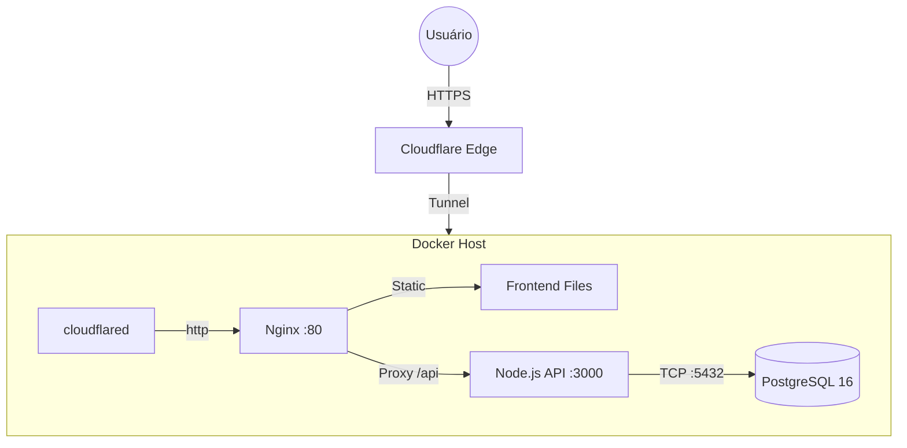

# 👮‍♂️ PMES - Gestão de Escalas & ISEO

Sistema desenvolvido para gerenciamento de escalas mensais (COPOM) e ISEO. Foco em performance, self-hosting e arquitetura leve para rodar em hardware ARM (Orange Pi).

## 🏗️ Arquitetura

O sistema roda atrás de um Cloudflare Tunnel, eliminando necessidade de abrir portas no roteador.



*Versão ASCII "raw"*

```text
┌─────────────────────────────────────────────────────┐
│                   CLOUDFLARE                        │
│            escalas.technove.com.br                  │
│                (SSL + Proxy + Tunnel)               │
└─────────────────────┬───────────────────────────────┘
                      │
┌─────────────────────▼───────────────────────────────┐
│               ORANGE PI 5 (Docker)                  │
│  ┌────────────────────────────────────────────────┐ │
│  │           cloudflared (tunnel)                 │ │
│  └────────────────────┬───────────────────────────┘ │
│                       │                             │
│  ┌────────────────────▼───────────────────────────┐ │
│  │              nginx (frontend)                  │ │
│  │         /mensal.html, /iseo.html               │ │
│  └────────────────────────────────────────────────┘ │
│                       │                             │
│  ┌────────────────────▼───────────────────────────┐ │
│  │         node:api (backend :3000)               │ │
│  │              Express + JWT                     │ │
│  └────────────────────┬───────────────────────────┘ │
│                       │                             │
│  ┌────────────────────▼───────────────────────────┐ │
│  │           postgres:16 (:5432)                  │ │
│  │              Volume persistente                │ │
│  └────────────────────────────────────────────────┘ │
└─────────────────────────────────────────────────────┘
```

## 🛠️ Tech Stack

* **Frontend:** HTML5, CSS3, Vanilla JS (Sem frameworks pesados).
* **Backend:** Node.js + Express.
* **Auth:** JWT + bcrypt.
* **Database:** PostgreSQL 16.
* **Infra:** Docker Compose + Cloudflare Tunnel.
* **Hardware:** Orange Pi 5 (ARM64).

## 📂 Estrutura

```text
escalas-pmes/
├── docker-compose.yml   # Orquestração
├── .env                 # Segredos (NÃO COMITAR)
├── frontend/            # Web Server (Nginx)
│   ├── mensal.html
│   ├── iseo.html
│   └── js/api.js        # Fetch wrapper
├── backend/             # API Server
│   ├── src/
│   │   ├── routes/      # Endpoints
│   │   └── models/      # Queries DB
└── database/
    └── init.sql         # Schema inicial
```

## 🚀 Como Rodar (Dev / Prod)

1. **Clone o repo:**
```bash
git clone [https://github.com/seu-user/pmes.git](https://github.com/seu-user/pmes.git)
cd pmes
```

2. **Configure o ambiente:**
Crie o arquivo `.env` baseado no exemplo:
```env
DB_USER=postgres
DB_PASS=sua_senha
DB_NAME=pmes_db
JWT_SECRET=segredo_super_seguro
TUNNEL_TOKEN=seu_token_cloudflare
```

3. **Suba a stack:**
```bash
docker compose up -d --build
```


4. **Acesse:**
* Local: `http://localhost`
* Web: `https://pmes.technove.com.br`

## ✅ Todo List

* [x] Estrutura Docker
* [x] Frontend Escala Mensal (v2.4.4)
* [ ] Backend API (Auth)
* [ ] Backend API (CRUD Escalas)
* [ ] Integração PostgreSQL

© 2026 Self-Labs
