# 👮‍♂️ PMES - Gestão de Escalas & ISEO

Sistema desenvolvido para gerenciamento de escalas mensais e ISEO. Foco em performance, self-hosting e arquitetura leve para rodar em hardware ARM (Orange Pi).

## 🏗️ Arquitetura

O sistema roda atrás de um Cloudflare Tunnel, eliminando necessidade de abrir portas no roteador.

```mermaid
graph TD
    User((Usuário)) -->|HTTPS| CF[Cloudflare Edge]
    CF -->|Tunnel| OPI[Orange Pi 5]
    
    subgraph OPI [Docker Host]
        Tun[cloudflared] -->|http| Nginx[Nginx :80]
        Nginx -->|Static| Front[Frontend Files]
        Nginx -->|Proxy /api| Node[Node.js API :8003]
        Node -->|TCP :5434| PG[(PostgreSQL 16)]
    end

```



*Versão ASCII "raw"*

```text
┌─────────────────────────────────────────────────────┐
│                   CLOUDFLARE                        │
│            pmes.technove.com.br                  │
│                (SSL + Proxy + Tunnel)               │
└─────────────────────┬───────────────────────────────┘
                      │
┌─────────────────────▼───────────────────────────────┐
│               ORANGE PI 5 (Docker)                  │
│  ┌────────────────────────────────────────────────┐ │
│  │           cloudflared (tunnel)                 │ │
│  └────────────────────┬───────────────────────────┘ │
│                       │                             │
│  ┌────────────────────▼───────────────────────────┐ │
│  │              nginx (frontend)                  │ │
│  │         /mensal.html, /iseo.html               │ │
│  └────────────────────────────────────────────────┘ │
│                       │                             │
│  ┌────────────────────▼───────────────────────────┐ │
│  │         node:api (backend :3000)               │ │
│  │              Express + JWT                     │ │
│  └────────────────────┬───────────────────────────┘ │
│                       │                             │
│  ┌────────────────────▼───────────────────────────┐ │
│  │           postgres:16 (:5434)                  │ │
│  │              Volume persistente                │ │
│  └────────────────────────────────────────────────┘ │
└─────────────────────────────────────────────────────┘
```

## 📋 Módulos

- **Escala Mensal** - Escala 12x24/12x72 com equipes A-E
- **Escala ISEO** - Escala diária de operações

## 🛠️ Tech Stack

* **Frontend:** HTML5, CSS3, Vanilla JS (Sem frameworks pesados).
* **Backend:** Node.js + Express.
* **Auth:** JWT + bcrypt.
* **Database:** PostgreSQL 16.
* **Infra:** Docker Compose + Cloudflare Tunnel.
* **Hardware:** Orange Pi 5 (ARM64).

## 🚀 Deploy
```bash
# Clone
git clone https://github.com/Self-Labs/pmes.git
cd pmes

# Configurar ambiente
cp .env.example .env
# Edite o .env com suas credenciais

# Subir containers
docker-compose up -d
```

## 🌐 Acesso

- **URL:** https://pmes.technove.com.br
- **Portas locais:**
  - Frontend: 3002
  - API: 8003
  - Database: 5434

## 📂 Estrutura
```text
pmes/
├── docker-compose.yml   # Orquestração
├── .env                 # Segredos (NÃO COMITAR)
├── frontend/            # Web Server (Nginx)
│   ├── mensal.html
│   ├── iseo.html
│   └── js/api.js        # Fetch wrapper
├── backend/             # API Server
│   ├── src/
│   │   ├── routes/      # Endpoints
│   │   └── models/      # Queries DB
└── database/
    └── init.sql         # Schema inicial
```

## 📝 Licença

© 2026 Self-Labs. Todos os direitos reservados.